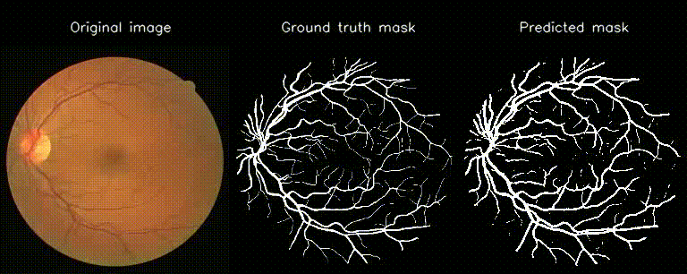

# MED-CXX



MED-CXX is a C++ project built with an object-oriented design, aiming to solve key medical imaging problems through deep learning. The project focuses on implementing and training several convolutional neural network (CNN) architectures — including U-Net, ResNet, and DenseNet — entirely in C++ using LibTorch (the PyTorch C++ API).

These models are applied to core medical tasks such as blood vessel segmentation, disease detection from medical scans, and image-based classification of pathological conditions.

MED-CXX was developed as part of the Object-Oriented Programming (OOP) lab course project at the Faculty of Mathematics and Computer Science, University of Bucharest, with a focus on clarity, reusability, and clean class structure.

---

## Changelog

### Implemented Features (May 2025) (v0.2)

- **UNet**, **ResNet**, and **DenseNet** implemented using LibTorch  
- **Blood vessel segmentation** on DRIVE/STARE datasets with visualization  
- **Weighted BCE + Dice loss** for handling class imbalance  
- **Model saving/loading** utilities (`saveModel`, `loadModel`)  
- **GIF/video demo generator** for showing side-by-side input / ground truth / prediction  
- **ImageLoader** with caching, preprocessing, and grayscale/threshold conversion  
- Modular class structure (`BaseModel`, `ImageLoader`, `Benchmark`, etc.)  
- Metrics: Accuracy, Precision, Recall, F1 Score, IoU, MAE, Hausdorff  
- Auto device selection (`CUDA` or `CPU`)  

### Implemented Features (June 2025) (v0.3)

- Unified **`med-cxx`** runner CLI via `common::ArgParser`  
- **Config** flags for:  
  - `--model`        : UNet / DenseNet / ResNet  
  - `--train-dir`    : path to training images (and masks for segmentation)  
  - `--test-dir`     : path to test images (and masks)  
  - `--cls-train-dir`: list of class-folders for classification  
  - `--model-name`   : human-friendly name (prefix for weight files & demos)  
  - `--weights`      : load existing `.pt` model file  
  - `--skip-train`   : skip training if weights are provided  
  - `--epochs, -e`   : number of training epochs  
  - `--lr`           : learning rate  
  - `--bce-weight`   : positive‐class weight for BCE loss  
  - `--cuda`         : request GPU (falls back to CPU if unavailable)  
  - `--resnet-ver`   : select ResNet18/34/50/101/152  
  - `--video`        : generate demo video (segmentation)  
  - `--fps`          : frames per second for demo video  
  - `--hold`         : how many frames to hold each sample  
  - `--bar-width`    : width of the training progress bar  
- Extracted **`BaseTrainer`**, **`SegmentationTrainer`**, **`ClassificationTrainer`**  
- **`printProgressBar`** utility in `common::Utils`  
- Clean separation: **runners/**, **trainer/**, **common/**, **models/**
- **Design Patterns**:
  - **Template Method**  
    `BaseModel::predict` defines the skeleton of inference, sub-classes (UNet, ResNet, DenseNet) fill in the details.  
  - **Composite**  
    All of our layer modules (`DoubleConv`, `Down`, `Up`, `BasicBlock`, etc.) inherit from a common base and can be nested arbitrarily inside `Sequential` containers.  
  - **Factory**  
    `ArgParser` + runner’s `switch(cfg.modelType)` cleanly instantiates different `BaseModel` subtypes.  
  - **Singleton** (planned)  
    A single global `Config` object to hold all CLI flags and share across trainers/visualizers.  
  - **Facade** (planned)  
    `BaseTrainer` + `SegmentationTrainer`/`ClassificationTrainer` hide all the details of data loading, optimization, loss, metrics and video generation behind a simple `train()` / `evaluate()` interface.

---

## Usage examples

```bash
# Show help
./med-cxx --help

# Segmentation: train & evaluate UNet 
./med-cxx \
  --model UNet \
  --train-dir data/train \
  --test-dir  data/test \
  --model-name vessels \
  --epochs 200 \
  --lr 1e-4 \
  --bce-weight 3.0 \
  --cuda \
  --video \
  --fps 2 \
  --hold 3

# Classification: train & evaluate DenseNet on folder-per-class
./med-cxx \
  --model DenseNet \
  --cls-train-dir data/cls/train \
  --cls-test-dir  data/cls/test \
  --model-name  classification_run \
  --epochs 50 \
  --lr 5e-4 \
  --skip-train  \
  --weights  classification_run.pt

# Run ResNet50 inference only on CPU
./med-cxx \
  --model ResNet \
  --resnet-ver 50 \
  --cls-test-dir data/cls/test \
  --skip-train \
  --weights resnet50_run.pt
```

---

## Installation

### Linux

```bash
# Install dependencies
sudo apt update
sudo apt install cmake libopencv-dev build-essential

# Clone the repo
git clone https://github.com/IAMSebyi/med-cxx.git
cd med-cxx

# Download LibTorch (instead of <COMPUTE PLATFORM>, use cpu, cu118, cu126, cu128)
wget https://download.pytorch.org/libtorch/<COMPUTE PLATFORM>/libtorch-cxx11-abi-shared-with-deps-2.7.0%2B<COMPUTE PLATFORM>.zip
unzip libtorch-cxx11-abi-shared-with-deps-2.7.0%2B<COMPUTE PLATFORM>.zip

# Build the project
mkdir build && cd build
cmake ..
make
```

### Windows

#### 1. Install dependencies

- [CMake](https://github.com/Kitware/CMake/releases/download/v4.0.1/cmake-4.0.1-windows-x86_64.msi)
- [OpenCV](https://github.com/opencv/opencv/releases/download/4.11.0/opencv-4.11.0-windows.exe)
- [Visual Studio 2022](https://visualstudio.microsoft.com/vs/)

#### 2. Clone the project

```bash
git clone https://github.com/IAMSebyi/med-cxx.git
cd med-cxx
```

#### 3. Download LibTorch (CPU or CUDA 11.8, 12.6, 12.8)

- [LibTorch](https://pytorch.org/)

#### 4. Configure and build using CMake

```bash
mkdir build && cd build
cmake ..
make
```

#### 5. Ensure *.dll files from libtorch/lib and opencv/build/x64/vcXX/bin are either in your PATH or next to your executable.

### Mac

```bash
# Install dependencies
brew install cmake opencv

# Clone the repo
git clone https://github.com/IAMSebyi/med-cxx.git
cd med-cxx

# Download LibTorch (only CPU supported)
https://download.pytorch.org/libtorch/cpu/libtorch-macos-arm64-2.7.0.zip
unzip libtorch-macos-arm64-2.7.0.zip

mkdir build && cd build
cmake ..
make
```

---

## Resources

- [**PyTorch Documentation**](https://docs.pytorch.org/docs/stable/index.html)
- [**OpenCV Documentation**](https://docs.opencv.org/4.x/index.html)
- [**U-Net: Convolutional Networks for Biomedical Image Segmentation**](https://arxiv.org/abs/1505.04597) - Olaf Ronneberger, Philipp Fischer, Thomas Brox
- [**Deep Residual Learning for Image Recognition**](https://arxiv.org/abs/1512.03385) - Kaiming He, Xiangyu Zhang, Shaoqing Ren, Jian Sun
- [**Densely Connected Convolutional Networks**](https://arxiv.org/abs/1608.06993) - Gao Huang, Zhuang Liu, Laurens van der Maaten, Kilian Q. Weinberger
- [**Locating blood vessels in retinal images by piecewise threshold probing of a matched filter response**](https://ieeexplore.ieee.org/document/845178) - Adam Hoover, V. Kouznetsova, Michael Goldbaum
